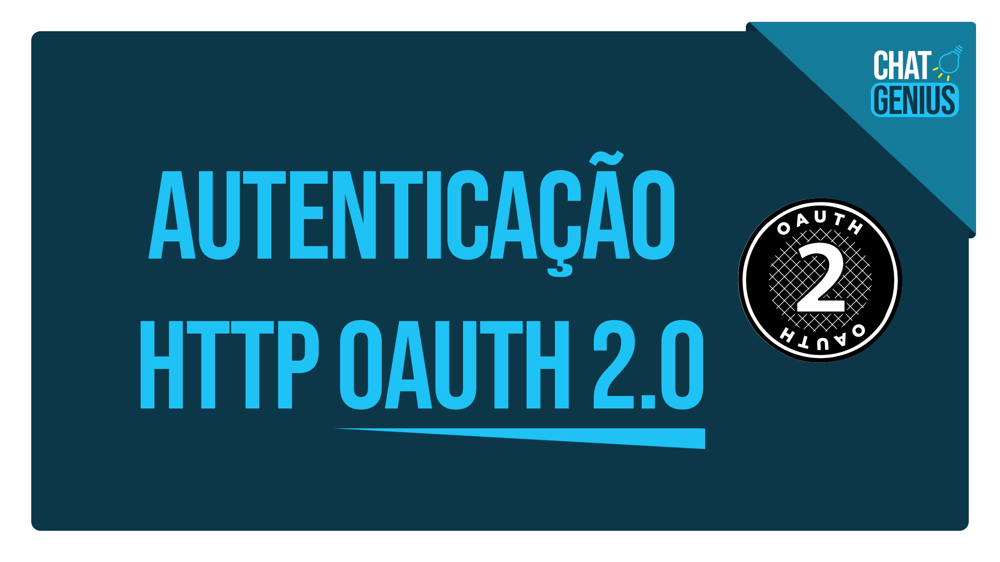

# OAuth 2.0 - Chamada HTTP

> Dados para utilizar na autenticação do OAuth 2.0 para as APIS do Google

Esse projeto é destinado a todos as pessoas que já visitaram [meu vídeo no Youtube](https://youtu.be/Cwwd9iiMeQo) sobre como realizar chamada para recuperar "Access Token".



## Configuração

### Documentação da API Oauth 2.0:

https://developers.google.com/identity/protocols/oauth2/web-server

### Console Google para criar as credenciais: 

```sh
> Lembre de selecionar o projeto correto
```

> https://console.cloud.google.com/apis/credentials

### Playground OAuth 2.0 - Google: 

```sh
> Esse link também será utilizado para utilizar como URI de redirecionamento na tela de consentimento
```

> https://developers.google.com/oauthplayground

## Dados para a chamada HTTP

Para recuperar o "Access Token" gerado através de uma chamda HTTP para o serviço OAuth 2.0 da Google você precisa seguir esse passo-a-passo.

Lembre-se de sempre realizar a requisição com o método _POST_.

```sh
> POST https://accounts.google.com/o/oauth2/token
```

Os dados do corpo (body) da requisição deverão conter as informações preenchidas, nesse formato:

```sh
{
       "client_secret" : "",
       "grant_type" : "refresh_token",
       "refresh_token" : "",
       "client_id" : ""
}
```


## Meta

Seu Nome – [@SeuNome](https://twitter.com/...) – SeuEmail@exemplo.com

[npm-image]: https://img.shields.io/npm/v/datadog-metrics.svg?style=flat-square
[npm-url]: https://npmjs.org/package/datadog-metrics
[npm-downloads]: https://img.shields.io/npm/dm/datadog-metrics.svg?style=flat-square
[travis-image]: https://img.shields.io/travis/dbader/node-datadog-metrics/master.svg?style=flat-square
[travis-url]: https://travis-ci.org/dbader/node-datadog-metrics
[wiki]: https://github.com/seunome/seuprojeto/wiki
